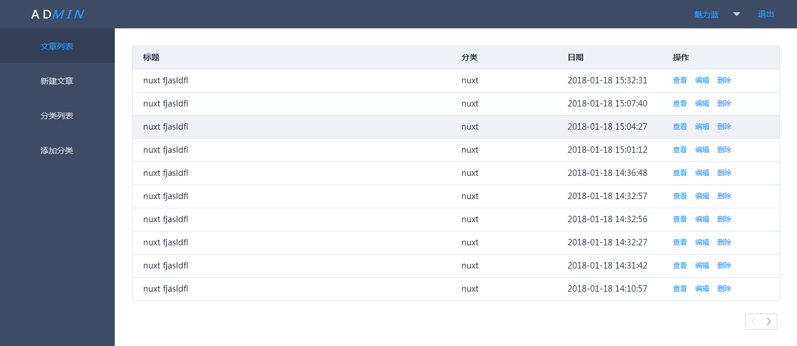
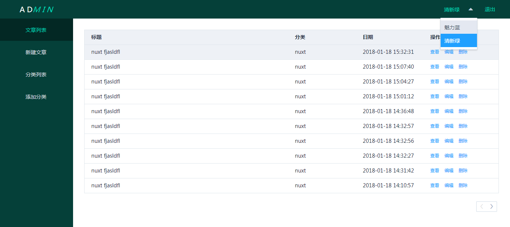
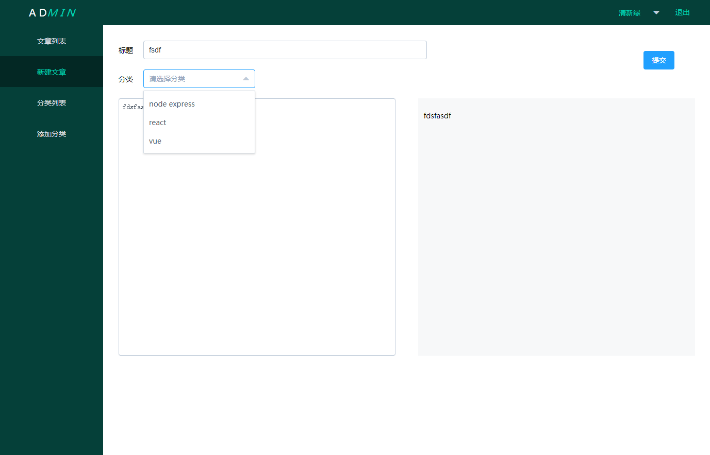
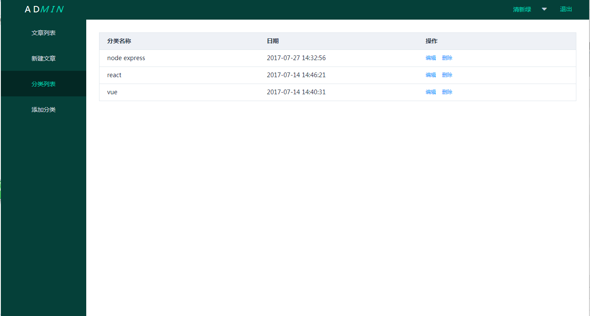
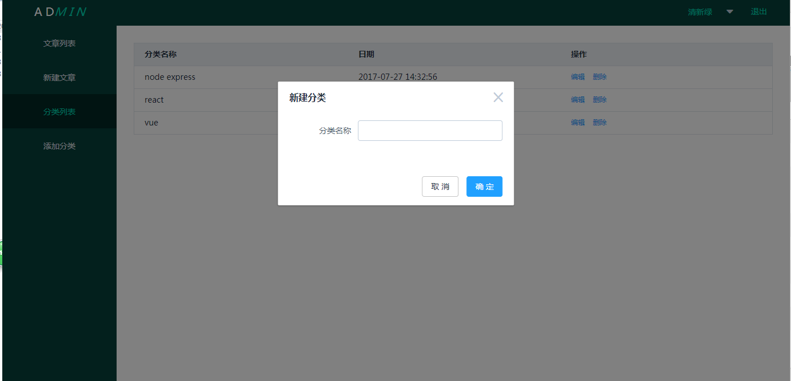

### 说明

#### 项目说明

本项目是基于vue-cli的后台管理项目。ajax请求用的axios库， ui使用的element-ui。

主要有注册、登录、新建文章、编辑文章、新建分类、编辑分类、删除文章、删除分类、换肤等功能

#### 项目运行

```bash
# 克隆项目
$ git clone https://github.com/zhangyu0414/vue-blog-admin.git

#进入blog-admin目录安装依赖
$ npm install # Or yarn install

# 启动热更新 at localhost:3333
$ npm run dev
```

#### 项目截图









